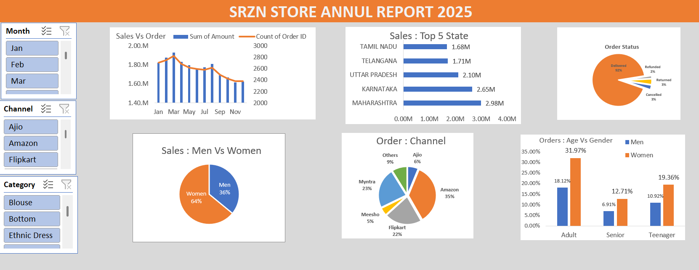
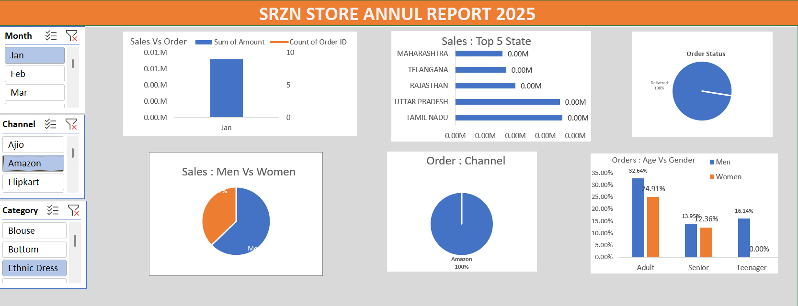

# 📊 SRZN Store Annual Report 2025 – Excel Dashboard

An **interactive Excel dashboard** designed to analyze **sales performance, customer behavior, order channels, and regional sales trends**.  
This project demonstrates **data analysis, data visualization, and business reporting skills using Microsoft Excel**.

---

## 📌 Project Overview

The **SRZN Store Annual Report 2025 Dashboard** provides a comprehensive view of sales data and helps identify key business insights such as:

- Monthly sales trends
- Top-performing states
- Customer demographics
- Order distribution by sales channel
- Order status and fulfillment insights

The dashboard is **fully interactive**, allowing users to filter data dynamically and explore insights easily.

---

## 🛠 Tools & Technologies Used

- Microsoft Excel  
- Pivot Tables  
- Pivot Charts  
- Data Cleaning  
- Data Visualization  
- Interactive Slicers  

---

## 📂 Dataset

The project uses the following files:

- **exceldataset.csv** – Raw dataset used for analysis  
- **SRZN STORE ANALYSIS.xlsx** – Excel file containing the interactive dashboard

---

## 📊 Dashboard Features

### Sales vs Orders
Displays the relationship between **sales amount and total orders across months**.

### Top 5 Sales by State
Highlights the **top-performing states based on total revenue**.

### Order Status
Visualizes order fulfillment distribution:
- Delivered
- Cancelled
- Returned
- Refunded

### Sales: Men vs Women
Shows **purchase distribution by gender**.

### Orders by Channel
Displays orders across major platforms:
- Amazon
- Flipkart
- Myntra
- Ajio
- Others

### Age vs Gender Orders
Analyzes purchasing patterns across age groups:
- Adult
- Senior
- Teenager

---

## 🎛 Interactive Filters

Users can explore the dashboard using filters for:

- **Month**
- **Sales Channel**
- **Product Category**

These filters allow **dynamic analysis of sales performance**.

---

## 📷 Dashboard Preview

### Main Dashboard

### Filtered Dashboard

---

---

## 📈 Key Insights

- Women contribute a **larger share of total purchases**.
- **Amazon is the leading sales channel**.
- **Maharashtra and Karnataka** generate strong revenue.
- **Adult customers contribute the highest number of orders**.

---

## 🚀 How to Use

1. Clone or download this repository.
2. Open **SRZN STORE ANALYSIS.xlsx** in Microsoft Excel.
3. Use the **interactive slicers and filters** to explore the dashboard.

---

## 👤 Author

**Srijan Rana**

MBA Student | Business & Data Analytics Enthusiast  
Skilled in **Excel, Power BI, Data Analysis, and Dashboard Development**

---

⭐ If you find this project useful, consider **starring the repository**.

